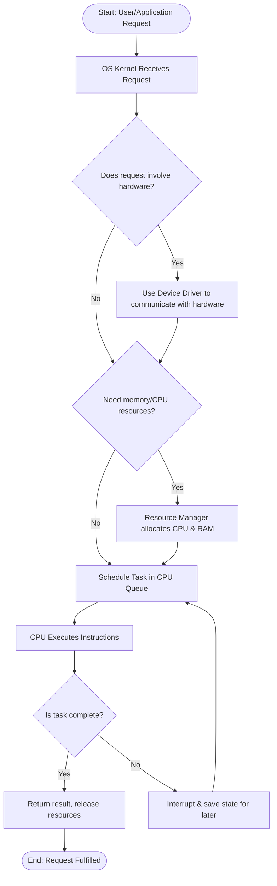
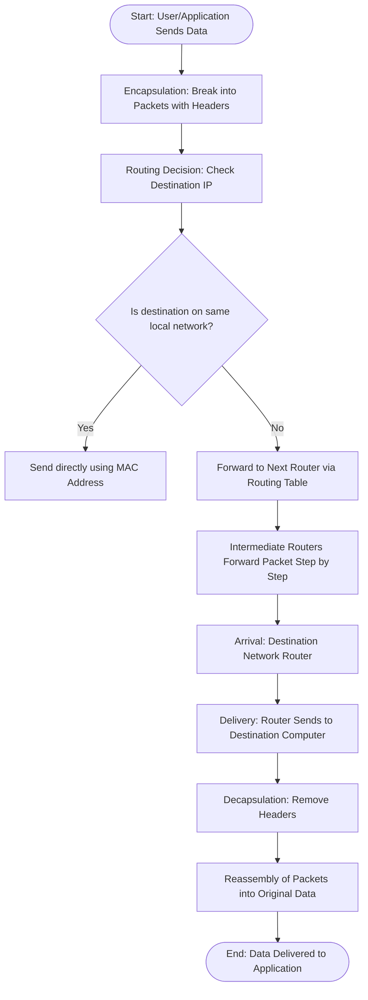
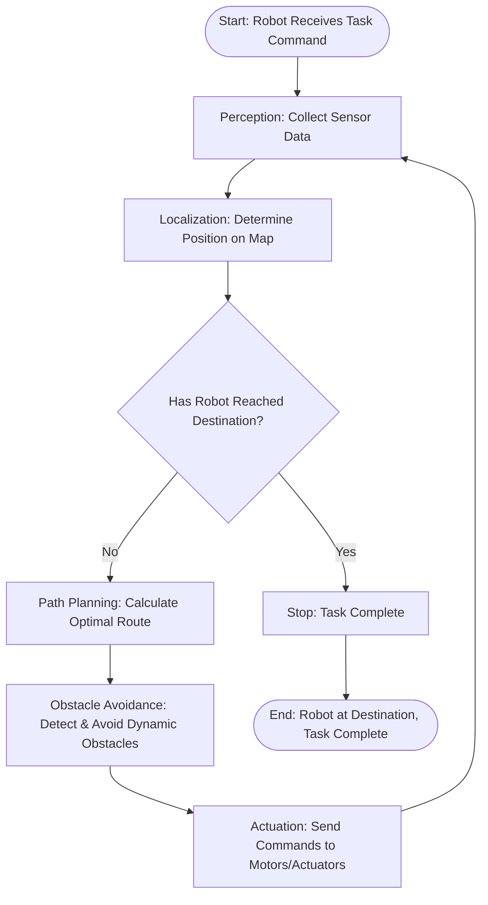

```mermaid
flowchart TD
    A([Start: Define Problem]) --> B[Collect Data]
    B --> C{Is data clean and formatted?}
    C -->|No| D[Clean data: handle missing values, remove duplicates, fix errors]
    C -->|Yes| E{Does data need transformation?}
    D --> E
    E -->|Yes| F[Normalize/scale, one-hot encode]
    E -->|No| G[Proceed]
    F --> G
    G --> H[Split data into train, validation, test sets]
    H --> I[Choose Model (e.g., Regression, Random Forest, NN)]
    I --> J[Train the Model]
    J --> K[Evaluate with validation set & tune hyperparameters]
    K --> L[Test on unseen test set]
    L --> M{Is performance satisfactory?}
    M -->|Yes| N[Deploy Model]
    M -->|No| E
    N --> O([End: Model in Use])

```

```mermaid
flowchart TD
    A([Start: Define Content Type]) --> B[Collect Large Dataset]
    B --> C[Prepare & Preprocess Data]
    C --> D[Choose Model (GAN, VAE, Transformer)]
    D --> E[Train the Model]
    E --> F{Is output quality good?}
    F -->|No| G[Adjust data, hyperparameters, or architecture]
    G --> E
    F -->|Yes| H[Model Ready: Accepts Prompt/Input]
    H --> I[Generate New Content]
    I --> J([End: System Creating Content])
    
    subgraph GAN Example
        E1[Generator creates fake data] --> E2[Discriminator evaluates]
        E2 --> E1
    end
    E -.-> E1

```





```mermaid
**flowchart TD
    A([Start: Developer Wants to Deploy App]) --> B[Select Cloud Resources: VM, Database, Storage]
    B --> C[Configure Services: OS, DB Type, Storage Amount]
    C --> D[Deployment: Upload Code, Provision Resources]
    D --> E{Need High Traffic Handling?}
    E -->|Yes| F[Set Auto-Scaling Rules]
    E -->|No| G[Run on Fixed Instances]
    F --> H[Monitoring: Performance, Usage, Costs]
    G --> H
    H --> I[Maintenance: App Updates (Provider Handles Infra)]
    I --> J[Scaling & Optimization Based on Monitoring Data]
    J --> K([End: App Running, Resources Managed Dynamically])
**
```



```mermaid
```

