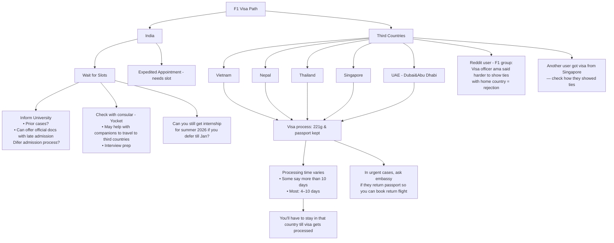

```mermaid
graph TD
    F1[F1 Visa Path]

    F1 --> India[India]
    F1 --> ThirdCountries[Third Countries]

    India --> WaitSlots[Wait for Slots]
    India --> Expedited[Expedited Appointment - needs slot]

    WaitSlots --> InformUni[Inform University<br>• Prior cases?<br>• Can offer official docs with late admission<br> Difer admission process?]
    WaitSlots --> CheckConsular[Check with consular - Yocket<br>• May help with companions to travel to third countries<br>• Interview prep]
    WaitSlots --> InternshipQ[Can you still get internship<br>for summer 2026 if you defer till Jan?]

    ThirdCountries --> Vietnam[Vietnam]
    ThirdCountries --> UAE[UAE - Dubai&Abu Dhabi]
    ThirdCountries --> Nepal[Nepal]
    ThirdCountries --> Thailand[Thailand]
    ThirdCountries --> Singapore[Singapore]

    Vietnam --> VisaHold[Visa process: 221g & passport kept]
    Nepal --> VisaHold
    Thailand --> VisaHold
    Singapore --> VisaHold
    UAE --> VisaHold

    VisaHold --> ProcessingTime[Processing time varies<br>• Some say more than 10 days<br>• Most: 4–10 days] --> PassportKept[You'll have to stay in that country till visa gets processed]
    VisaHold --> AskEmbassy[In urgent cases, ask embassy<br>if they return passport so you can book return flight]

    ThirdCountries --> RedditCase[Reddit user - F1 group:<br>Visa officer ama said harder to show ties<br>with home country = rejection]

    ThirdCountries --> SGCase[Another user got visa from Singapore<br>— check how they showed ties]
```
