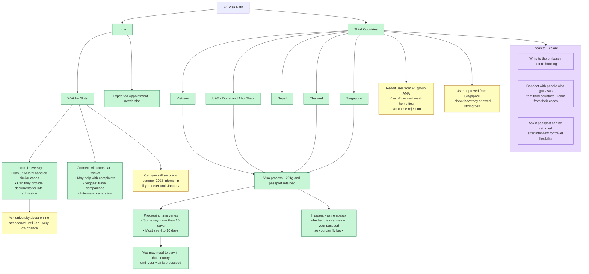

```mermaid
graph TD
    F1[F1 Visa Path]

    F1 --> India[India]
    F1 --> ThirdCountries[Third Countries]

    India --> WaitSlots[Wait for Slots]
    India --> Expedited[Expedited Appointment - needs slot]

    WaitSlots --> InformUni[Inform University<br>• Has university handled similar cases<br>• Can they provide documents for late admission]
    InformUni --> Online[Ask university about online attendance until Jan - very low chance]

    WaitSlots --> CheckConsular[Connect with consular - Yocket<br>• May help with complaints<br>• Suggest travel companions<br>• Interview preparation]

    WaitSlots --> InternshipQ[Can you still secure a summer 2026 internship<br>if you defer until January]

    ThirdCountries --> Vietnam[Vietnam]
    ThirdCountries --> UAE[UAE - Dubai and Abu Dhabi]
    ThirdCountries --> Nepal[Nepal]
    ThirdCountries --> Thailand[Thailand]
    ThirdCountries --> Singapore[Singapore]

    Vietnam --> VisaHold[Visa process - 221g and passport retained]
    Nepal --> VisaHold
    Thailand --> VisaHold
    Singapore --> VisaHold
    UAE --> VisaHold

    VisaHold --> ProcessingTime[Processing time varies<br>• Some say more than 10 days<br>• Most say 4 to 10 days]
    ProcessingTime --> PassportKept[You may need to stay in that country<br>until your visa is processed]

    VisaHold --> AskEmbassy[If urgent - ask embassy<br>whether they can return your passport<br>so you can fly back]

    ThirdCountries --> RedditCase[Reddit user from F1 group AMA<br>Visa officer said weak home ties<br>can cause rejection]

    ThirdCountries --> SGCase[User approved from Singapore<br>- check how they showed strong ties]

    %% Purple "Ideas" group
    subgraph IdeasBox["Ideas to Explore"]
        Idea1[Write to the embassy before booking]
        Idea2[Connect with people who got visas<br>from third countries - learn from their cases]
        Idea3[Ask if passport can be returned<br>after interview for travel flexibility]
    end

    ThirdCountries --> IdeasBox

    %% Styling
    classDef green fill:#c6f6d5,stroke:#2f855a,stroke-width:1px;
    classDef yellow fill:#fefcbf,stroke:#b7791f,stroke-width:1px;
    classDef ideas fill:#e9d8fd,stroke:#805ad5,stroke-width:1px;

    class India,ThirdCountries,WaitSlots,Expedited,InformUni,CheckConsular,Vietnam,UAE,Nepal,Thailand,Singapore,VisaHold,ProcessingTime,AskEmbassy,PassportKept green;
    class InternshipQ,RedditCase,SGCase,Online yellow;
    class IdeasBox,Idea1,Idea2,Idea3 ideas;
```
