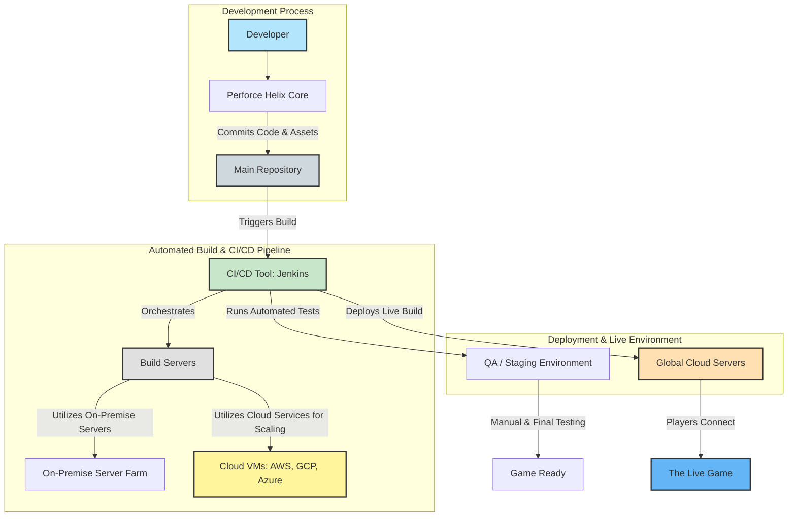

### Game Development, Build, and Deployment Pipeline

```mermaid
flowchart TD
    subgraph "Development Process"
        A[Developer] --> B["Perforce Helix Core"]
        B -- "Commits Code & Assets" --> C["Main Repository"]
    end

    subgraph "Automated Build & CI/CD Pipeline"
        C -- "Triggers Build" --> D["CI/CD Tool: Jenkins"]
        D -- "Orchestrates" --> E["Build Servers"]
        E -- "Utilizes On-Premise Servers" --> F["On-Premise Server Farm"]
        E -- "Utilizes Cloud Services for Scaling" --> G["Cloud VMs: AWS, GCP, Azure"]
    end

    subgraph "Deployment & Live Environment"
        D -- "Runs Automated Tests" --> H["QA / Staging Environment"]
        D -- "Deploys Live Build" --> I["Global Cloud Servers"]
    end

    H -- "Manual & Final Testing" --> J["Game Ready"]
    I -- "Players Connect" --> K["The Live Game"]

    style A fill:#b3e5fc,stroke:#333,stroke-width:2px
    style K fill:#64b5f6,stroke:#333,stroke-width:2px
    style D fill:#c8e6c9,stroke:#333,stroke-width:2px
    style G fill:#fff59d,stroke:#333,stroke-width:2px
    style I fill:#ffe0b2,stroke:#333,stroke-width:2px
    style E fill:#e0e0e0,stroke:#333,stroke-width:2px
    style C fill:#cfd8dc,stroke:#333,stroke-width:2px
```
