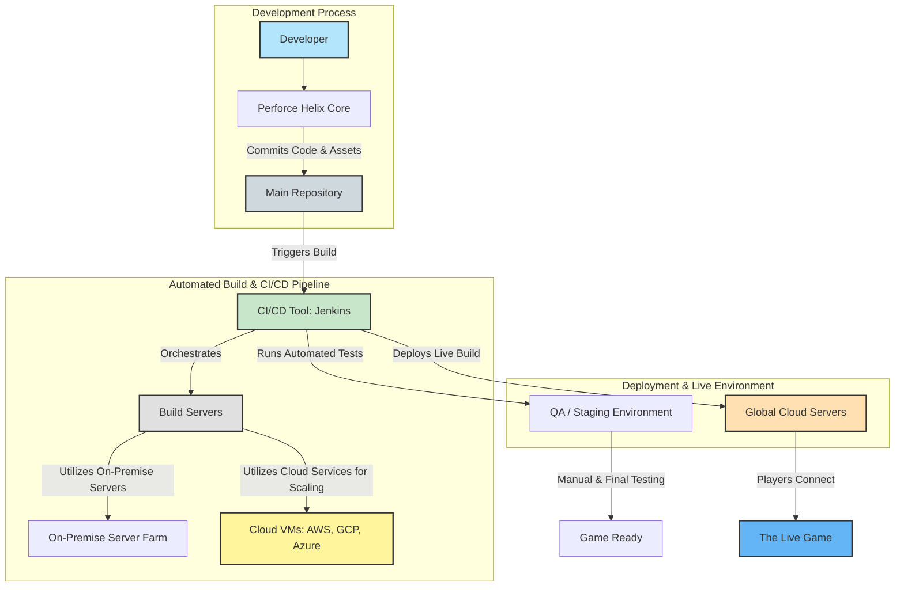
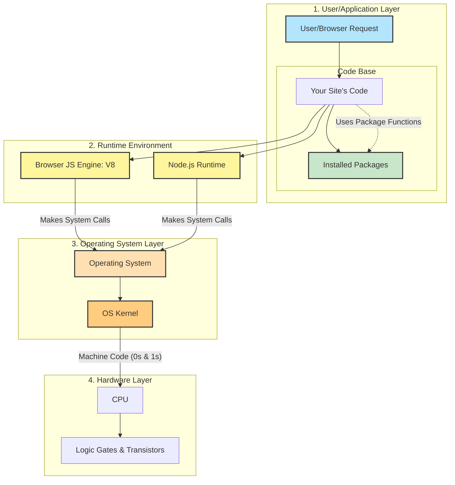
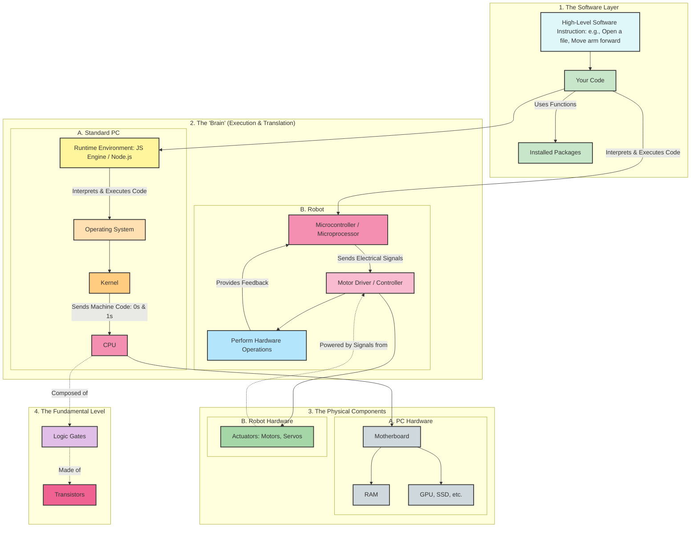
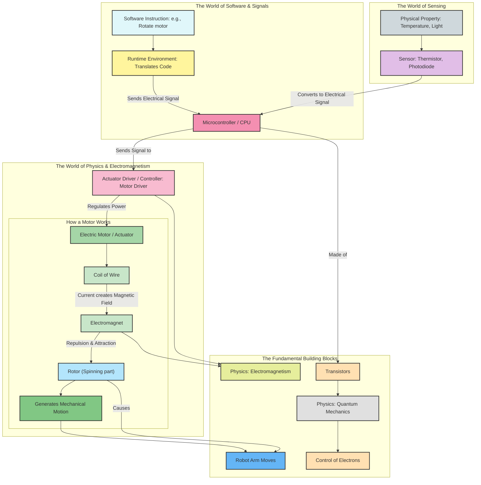
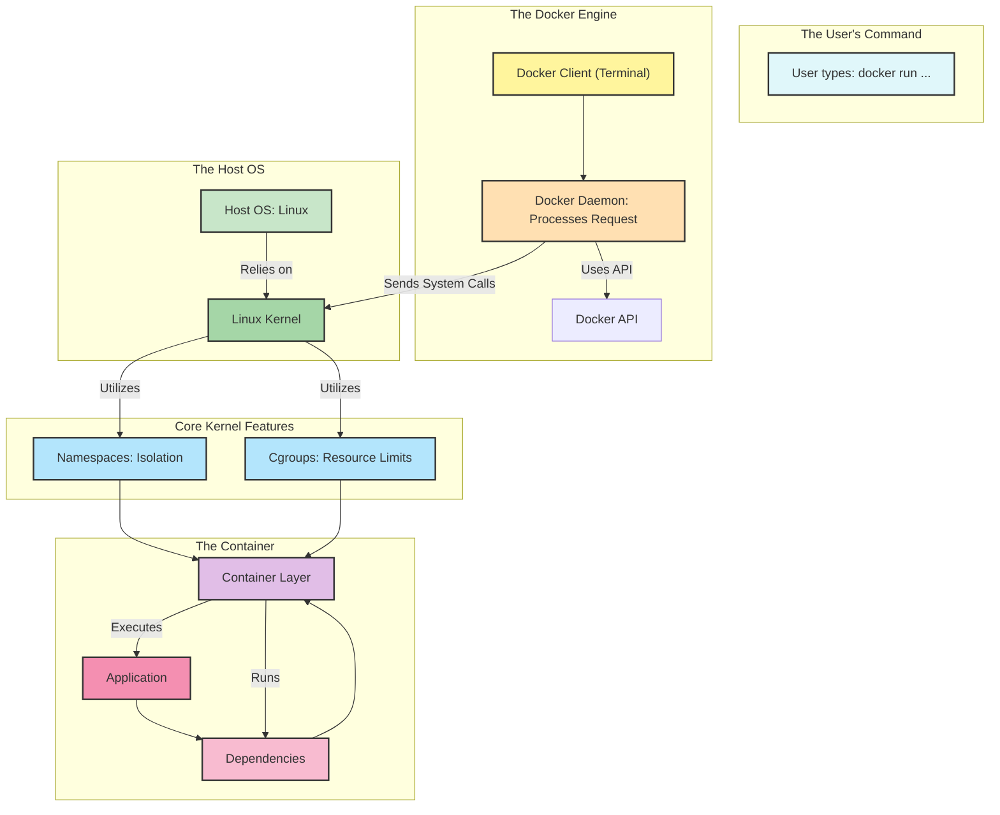

### Game Development, Build, and Deployment Pipeline

### Full-Stack JavaScript Execution Pipeline

### Software to Hardware Execution Pipeline (PC & Robotics)

### Software to Hardware Execution Pipeline (PC & Robotics)

### Docker Container Execution Pipeline

